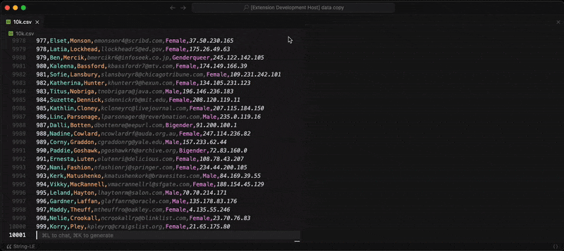
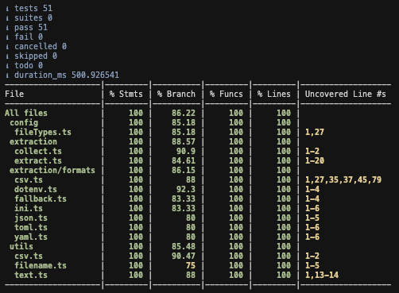

  

<h1 align="center">String-LE: Zero Hassle String Extraction</h1>

  <b>Instantly extract every user-visible- in precise order</b> 
  <i>JSON YAML CSV TOML INI ENV</i>

  <!-- Marketplace -->
  
  <!-- Build -->
  
  <!-- License -->
  

---

  

 <a href="https://github.com/nolindnaidoo/string-le/blob/main/docs/SCREENSHOTS.md">Screenshot Guide</a>

## ✅ Why String-LE

**Modern projects scatter text everywhere** — APIs, configs, CSVs, and locale files across both native and web. Keeping those strings consistent is still a slow, manual grind.

**String-LE makes extraction effortless.**  
It smartly pulls out only the **true user-visible strings** (never numbers, IDs, or raw values) and gives you a clean, ordered set of text that’s ready for production.

- **i18n without the hassle**  

  Instantly extract and de-duplicate locale strings into `en.json`, `fr.json`, or any language pack. Keep translation files lean and in sync across your codebase.

- **Clarity across configs & APIs**  
  Surface every user-facing message. Validation errors, system prompts, and API responses are cataloged in one place.

- **Confident edits in complex specs**  
  Flatten nested strings into a simple list you can safely edit without breaking structure or formatting.

- **Stream massive CSVs**  
  Work with millions of rows without locking up VS Code. Select only the columns you need and stream results directly to the editor.

- **Automatic cleanup built-in**  
  - **Sort** for stable diffs and reviews  
  - **Dedupe** to eliminate noise
  - **Trim whitespace** (NEW) 
  

- **Fast at any scale**  
  Benchmarked at millions of lines per second, String-LE keeps up with large datasets and enterprise monorepos without slowing you down.

- **Coming Soon**
  - **Chunk Splitting** (1.1.0)
  - **Casing rules** (1.2.0)
  
- **Evaluating**
  - **Filetype: xml** (1.3.0)
  - **Filetype: plist** (1.4.0)
  - **Filetype: stroryboard** (1.5.0)
  - **Filetype: xib** (1.6.0)  
  - **Filetype: arb** (1.7.0)
  - **Filetype: .ts** (1.8.0)
  - **Filetype: .js** (1.9.0)
  - **Filetype: .py** (1.10.0)
  - **Filetype: .rs** (1.11.0)
  - **Filetype: .kt** (1.12.0)
  - **Filetype: .swift** (1.13.0)
  - **Filetype: .dart** (1.14.0)
  - **Filetype: .go** (1.15.0)
  - **Filetype: .rb** (1.16.0)

## 🚀 Quick Start

1. Install from the VS Code Marketplace.
2. Open any supported file type (`Cmd/Ctrl + P String-LE`).
3. Run Quick Extract (`Cmd+Alt+E` / `Ctrl+Alt+E` / Status Bar).

## ⚙️ Configuration

- `string-le.openResultsSideBySide` – Open to the side
- `string-le.csv.streamingEnabled` – Toggle CSV streaming
- `string-le.dedupeEnabled` – Auto-dedupe strings
- `string-le.sortEnabled` – Auto-sort output
- **Safety Guards** – File size warnings & thresholds
- **Notification Levels** – Control verbosity and alerts

### ⚠️ Behaviors & Limits

- CSV support assumes standard delimiter/quoting; unusual dialects not supported
- Large outputs can be slow to open — use **Copy** when prompted
- Streaming applies only to CSV; other formats load in memory
- Multi-line strings (e.g., YAML block scalars) are only partially supported
- CSV multi-line and all-column extracts stream to the editor only (no auto-copy)
- Sorting and deduplication apply to final strings, not their original positions
- Fallback mode uses quoted-string heuristics and may include false positives

See [`CONFIGURATION.md`](docs/CONFIGURATION.md).

## ⚡ Performance

String-LE is built for speed across all supported formats:

| Format   | Throughput      | Best For               |
| -------- | --------------- | ---------------------- |
| **ENV**  | 4M+ lines/sec   | Environment configs    |
| **JSON** | 1.8M+ lines/sec | APIs, large datasets   |
| **INI**  | 1.3M+ lines/sec | Configuration files    |
| **TOML** | 530K+ lines/sec | Modern configs         |
| **CSV**  | 440K+ lines/sec | Tabular data           |
| **YAML** | 190K+ lines/sec | Human-readable configs |

See [`PERFORMANCE.md`](docs/PERFORMANCE.md).

## 🌍 Language Support

English + 12 translations:

- Chinese (Simplified), Spanish, French, Russian, Portuguese (Brazil)
- Japanese, Korean, German, Italian, Vietnamese, Ukrainian, Indonesian

See [`I18N.md`](docs/I18N.md).

## 🔒 Privacy & Telemetry

- Runs entirely locally; no data is sent off your machine.
- Optional local-only logs can be enabled with `string-le.telemetryEnabled`.
- Logs appear in Output panel → “String-LE”.

See [`PRIVACY.md`](docs/PRIVACY.md).

## 📊 Test Coverage

- 100% unit coverage on pure extraction and transforms
- Contract tests for configuration side-effects and parse-error handling
- Data-driven fixtures with golden expected outputs per format
- CSV streaming paths covered (batching, header/column selection)
- Stable locale sorting and dedupe normalization in harness

See [`TESTING.md`](docs/TESTING.md).

## 🤝 Contributing

We welcome all contributions! Whether it's code, ideas, or feedback:

- [Issues](https://github.com/nolindnaidoo/string-le/issues) • [Pull Requests](https://github.com/nolindnaidoo/string-le/pulls) • [Releases](https://github.com/nolindnaidoo/string-le/releases)
- [Spec](docs/SPECIFICATION.md) • [Architecture](docs/ARCHITECTURE.md) • [Development](docs/DEVELOPMENT.md) • [Contributing](CONTRIBUTING.md) • [Troubleshooting](docs/TROUBLESHOOTING.md)
- [Commands](docs/COMMANDS.md) • [Notifications](docs/NOTIFICATIONS.md) • [Status Bar](docs/STATUSBAR.md) • [Config](docs/CONFIGURATION.md) • [Performance](docs/PERFORMANCE.md) • [I18N](docs/I18N.md) • [Privacy](docs/PRIVACY.md) • [Screenshots](docs/SCREENSHOTS.md) • [Workflow](docs/WORKFLOW.md)

---

Copyright © 2025  
<a href="https://github.com/nolindnaidoo">@nolindnaidoo</a>. All rights reserved.
