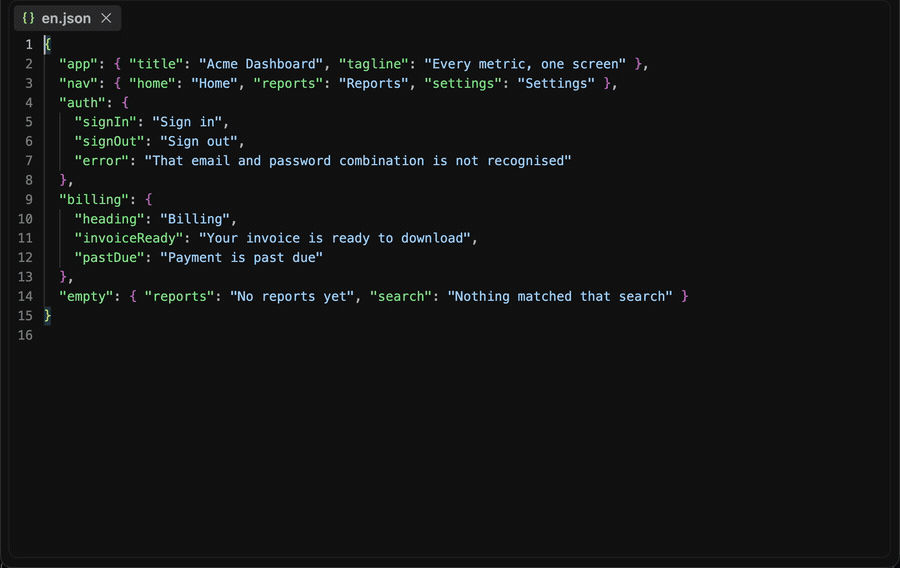

<p align="center">
  
</p>
<h1 align="center">Strings-LE: Zero Hassle String Extraction</h1>
<p align="center">
  <b>Pull every string value out of the current file in one keystroke</b><br/>
  <i>JSON, YAML, CSV, TOML, INI, and Environment files</i>
</p>

<p align="center">
  <a href="https://marketplace.visualstudio.com/items?itemName=nolindnaidoo.string-le">
    
  </a>
  <a href="https://letools.dev">
    
  </a>
</p>

---

<p align="center">
  
</p>

## What it does

Open a file, press `Ctrl+Alt+E` (`Cmd+Alt+E` on Mac), and every string value in the document lands in a new editor — deduplicate and sort it from there. Works in VS Code and in VS Code–based editors like Cursor and VSCodium (installable from Open VSX).

- **i18n prep** — flatten locale files (JSON/YAML) into a clean list of translatable values
- **Config review** — see every string value in a TOML/INI/.env file at a glance
- **CSV mining** — pull one column, several, or all of them; stream very large files

## Supported formats

| Format | Language IDs | What gets extracted |
|---|---|---|
| JSON | `json` | String values (parsed; keys, numbers, and booleans excluded) |
| YAML | `yaml` | String values including unquoted plain scalars, block/folded scalars, and multi-document files |
| CSV | `csv` | Cells, with optional header handling, column selection, and a streaming mode for large files |
| TOML | `toml` | String values including multiline strings; dates and numbers are excluded as typed values |
| INI | `ini` | Values (INI is untyped, so numeric-looking values are extracted as strings) |
| Environment | `dotenv`, `env` | Values (`export` prefixes, quotes, and inline comments handled) |
| Anything else | — | Fallback scan for `"double"`, `'single'`, or `` `backtick` `` quoted strings on a single line |

Values are trimmed; empty values are dropped; keys are never extracted. The fallback scan cannot see unquoted or multi-line strings — that is why the six formats above get real parsers. Parse errors are silent unless `string-le.showParseErrors` is on.

## Commands

| Command | Description |
|---|---|
| `String-LE: Extract Strings` (`Ctrl+Alt+E` / `Cmd+Alt+E`) | Extract all string values from the active document |
| `String-LE: Deduplicate Strings` | Remove duplicate lines from the active document |
| `String-LE: Sort Strings` | Sort lines alphabetically or by length |
| `String-LE: Toggle CSV Streaming` | Enable/disable streaming for large CSV files |
| `String-LE: Open Settings` | Open String-LE settings |
| `String-LE: Help & Troubleshooting` | Built-in documentation |

## Settings

| Setting | Default | Description |
|---|---|---|
| `string-le.openResultsSideBySide` | `true` | Open results beside the current editor |
| `string-le.postProcess.openInNewFile` | `true` | Post-process commands write to a new file instead of editing in place |
| `string-le.copyToClipboardEnabled` | `false` | Also copy results to the clipboard (disabled for CSV output) |
| `string-le.dedupeEnabled` | `false` | Deduplicate results automatically after extraction |
| `string-le.sortEnabled` | `false` | Sort results automatically after extraction |
| `string-le.sortMode` | `off` | `alpha-asc`, `alpha-desc`, `length-asc`, `length-desc` |
| `string-le.csv.streamingEnabled` | `false` | Stream CSV results into the editor incrementally |
| `string-le.showParseErrors` | `false` | Show parse errors as notifications |
| `string-le.notificationsLevel` | `silent` | `all` = every notification, `important` = warnings + errors, `silent` = errors only |
| `string-le.safety.enabled` | `true` | Guardrails for very large files/outputs |
| `string-le.safety.fileSizeWarnBytes` | `1000000` | Warn before extracting above this file size |
| `string-le.safety.largeOutputLinesThreshold` | `50000` | Offer Open/Copy/Cancel above this result count |
| `string-le.safety.manyDocumentsThreshold` | `8` | Confirm before opening this many result documents (CSV multi-column) |
| `string-le.statusBar.enabled` | `true` | Show the status bar item |
| `string-le.telemetryEnabled` | `false` | Local-only event log (see Privacy) |

The settings UI is translated into 12 languages besides English.

## Privacy & security

- **No network access.** The extension never sends data anywhere. The `telemetryEnabled` setting only writes events to a local Output Channel you can inspect (`String-LE`).
- Error notifications redact home directories and credential-shaped fragments.

## Development

```bash
bun install
bun run build            # esbuild bundle -> dist/extension.js
bun run typecheck        # tsc --noEmit (includes tests)
bun run test             # vitest unit suite
bun run test:integration # real VS Code extension host
bun run lint             # biome
bun run package          # VSIX into release/
```

Architecture and conventions live in [AGENTS.md](AGENTS.md). Changes are tracked in [CHANGELOG.md](CHANGELOG.md).

## More from the LE Family

Every tool in the family, one page: **[letools.dev](https://letools.dev)**

- **[Paths-LE](https://marketplace.visualstudio.com/items?itemName=nolindnaidoo.paths-le)** - Extract file paths from imports and dependencies
- **[Numbers-LE](https://marketplace.visualstudio.com/items?itemName=nolindnaidoo.numbers-le)** - Extract and analyze numeric data with statistics
- **[EnvSync-LE](https://marketplace.visualstudio.com/items?itemName=nolindnaidoo.envsync-le)** - Keep .env files in sync with visual diffs
- **[Regex-LE](https://marketplace.visualstudio.com/items?itemName=nolindnaidoo.regex-le)** - Test and validate regex patterns with live feedback
- **[Secrets-LE](https://marketplace.visualstudio.com/items?itemName=nolindnaidoo.secrets-le)** - Detect and sanitize secrets before you commit
- **[Scrape-LE](https://marketplace.visualstudio.com/items?itemName=nolindnaidoo.scrape-le)** - Validate scraper targets before debugging
- **[Colors-LE](https://marketplace.visualstudio.com/items?itemName=nolindnaidoo.colors-le)** - Extract and analyze colors from stylesheets
- **[URLs-LE](https://marketplace.visualstudio.com/items?itemName=nolindnaidoo.urls-le)** - Extract URLs from any codebase with precision
- **[Dates-LE](https://marketplace.visualstudio.com/items?itemName=nolindnaidoo.dates-le)** - Extract temporal data from logs and APIs

## License

MIT © [nolindnaidoo](https://github.com/nolindnaidoo)
