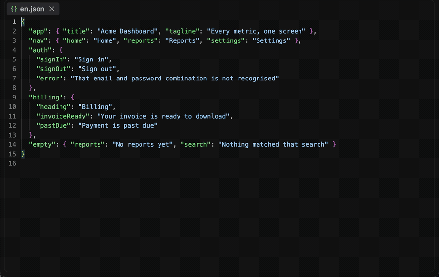

<p align="center">
  
</p>
<h1 align="center">Strings-LE: Zero Hassle String Extraction</h1>
<p align="center">
  <b>Pull every string value out of the current file in one keystroke</b><br/>
  <i>JSON/JSONC, YAML, CSV/TSV, TOML, INI, Environment files, and ten source languages</i>
</p>

<p align="center">
  <a href="https://marketplace.visualstudio.com/items?itemName=nolindnaidoo.string-le">
    
  </a>
  <a href="https://open-vsx.org/extension/nolindnaidoo/string-le">
    
  </a>
  <a href="https://www.npmjs.com/package/string-le-mcp">
    
  </a>
  <a href="https://crates.io/crates/string-le">
    
  </a>
  <a href="https://letools.dev/tools/string-le">
    
  </a>
</p>

---

<p align="center">
  
</p>

> **Useful?** A star or rating is how other developers find it —
> [★ GitHub](https://github.com/nolindnaidoo/string-le) ·
> [★ Open VSX](https://open-vsx.org/extension/nolindnaidoo/string-le/reviews) ·
> [★ Marketplace](https://marketplace.visualstudio.com/items?itemName=nolindnaidoo.string-le&ssr=false#review-details)

## What it does

Open a file, run `String-LE: Extract Strings`, and every string value in the document lands in a new editor — deduplicate and sort it from there. Works in VS Code and in VS Code–based editors like Cursor and VSCodium (installable from Open VSX).

- **i18n prep** — flatten locale files (JSON/YAML) into a clean list of translatable values
- **Config review** — see every string value in a TOML/INI/.env file at a glance
- **CSV mining** — pull one column, several, or all of them; stream very large files

## Install

| Where | What you get | Install |
|---|---|---|
| **VS Code** | The same extraction, in your editor, on a keystroke | [Marketplace](https://marketplace.visualstudio.com/items?itemName=nolindnaidoo.string-le) |
| **Cursor, VSCodium, Windsurf** | The same extension | [Open VSX](https://open-vsx.org/extension/nolindnaidoo/string-le) |
| **A terminal or a CI step** | The same run over a whole tree, with exit codes | `cargo install string-le` · [crates.io](https://crates.io/crates/string-le) |
| **Any MCP agent, via Node** | `extract_strings` over stdio | `npx string-le-mcp` · [npm](https://www.npmjs.com/package/string-le-mcp) |

## Use it from an AI agent

The same engine runs as an [MCP](https://modelcontextprotocol.io) server, so an agent can call it directly instead of you running a command.

| Editor | How |
|---|---|
| **VS Code** 1.101+ | Nothing to install — the extension registers `extract_strings` with agent mode |
| **Claude Code** | `claude mcp add string-le -- npx -y string-le-mcp` |
| **Cursor, Windsurf, anything else** | point it at `npx string-le-mcp` |

```
extract_strings(content, format?, filename?, dedupe?, multiline?, maxResults?)
```

Returns the values in document order, capped at 500 by default with `meta.truncated`. A format is optional — any unrecognised format falls back to quoted strings.

The server takes content and returns data — it reads no files and makes no network requests of its own. Published as [`string-le-mcp`](https://www.npmjs.com/package/string-le-mcp) on npm and as `io.github.nolindnaidoo/string-le` in the [MCP registry](https://registry.modelcontextprotocol.io).

<details>
<summary><b>Configuring it by hand</b> — any host with an MCP config file</summary>

Most hosts read a JSON config. Add one entry:

```json
{
  "mcpServers": {
    "string-le": {
      "command": "npx",
      "args": ["-y", "string-le-mcp"]
    }
  }
}
```

`-y` skips the install prompt on first run. Pin a version if you would rather not track releases — `string-le-mcp@2.5.0`.

Prefer not to go through `npx` on every launch? Install it once and point at the binary instead:

```bash
npm install -g string-le-mcp
```

```json
{
  "mcpServers": {
    "string-le": { "command": "string-le-mcp" }
  }
}
```

It speaks MCP over stdio and needs no environment variables, no API key and no configuration of its own. To check it before wiring it into anything:

```bash
echo '{"jsonrpc":"2.0","id":1,"method":"tools/list"}' | npx -y string-le-mcp
```

That prints the tool list and exits — if you see `extract_strings`, the server works.

</details>

## Supported formats

| Format | Language IDs | What gets extracted |
|---|---|---|
| JSON | `json` | String values (parsed; keys, numbers, and booleans excluded) |
| YAML | `yaml` | String values including unquoted plain scalars, block/folded scalars, and multi-document files |
| CSV | `csv` | Cells, with optional header handling, column selection, and a streaming mode for large files |
| TOML | `toml` | String values including multiline strings; dates and numbers are excluded as typed values |
| INI | `ini` | Values (INI is untyped, so numeric-looking values are extracted as strings) |
| Environment | `dotenv`, `env` | Values (`export` prefixes, quotes, and inline comments handled) |
| Python | `python` | Triple-quoted docstrings as one string, f-strings, `r`/`b`/`u` prefixes |
| Rust | `rust` | Raw strings `r"…"`, `r#"…"#`, `r##"…"##` as one string with their inner quotes; byte strings |
| Go | `go` | Backtick raw strings as one string, across lines |
| Shell | `shellscript` | Heredocs (`<<EOF`, `<<'EOF'`, `<<-EOF`) as one string |
| PHP, Ruby, Perl | `php`, `ruby`, `perl` | Heredocs and nowdocs (`<<<EOT`, `<<<'NOW'`, `<<~EOS`) as one string |
| C# | `csharp` | Verbatim `@"…"` where `""` is one quote; interpolated `$"…"` |
| JavaScript, TypeScript | `javascript`, `typescript` (+ the react ids) | Template literals as **one** string, interpolation and nesting included |
| Markdown, anything else | `markdown` | Fallback scan for `"double"`, `'single'`, or `` `backtick` `` quoted strings on a single line |

Values are trimmed; empty values are dropped; keys are never extracted — one rule, shared by every extractor above. The fallback scan cannot see unquoted strings, which is why the parsed formats and the source languages get real readers; it reads a quoted run across lines when `string-le.fallback.multiline` is on (the MCP tool's `multiline`). Parse errors are silent unless `string-le.showParseErrors` is on.

## Across a folder or a workspace

Extract reads the document you have open. A scan reads many files from disk and gives one report.

- **The whole workspace**: run `String-LE: Extract Strings from Workspace` from the command palette.
- **One folder**: right-click it in the Explorer and choose `Extract Strings from Folder`, or run `String-LE: Extract Strings from Folder` and pick one.

A project writes the same string in many places, so the report is the distinct strings, the most widely used first, with how often each is written and where:

```markdown
# String-LE workspace report

`my-project` · 4 file(s) read · 2 distinct string(s), 6 occurrence(s) in 3 file(s)

| String | Occurrences | Files |
|---|---|---|
| `Save changes` | 4 | 3 |
| `Cancel` | 2 | 2 |

## `Save changes` (4)

- `i18n/en.json` · **2:11**
- `src/a.ts` · **1:11**, **3:11**
- `src/b.py` · **1:9**

## `Cancel` (2)

- `i18n/en.json` · **3:13**
- `src/a.ts` · **2:11**

## Could not be read (1)

- `bad.json`: Invalid JSON: Unexpected end of JSON input
```

Positions follow `string-le.showPositions`. With it off, each line is the file and how many times the string is in it: `src/a.ts (2)`. The copy on the clipboard follows `string-le.clipboardIncludesPositions`, as it does for Extract.

A file its format reader could not parse is listed with the reason, never passed over. A string longer than 120 characters, or one with a line break, is shown as one cut line. Two strings are still compared whole.

**What a scan reads.** Files come from disk, so an unsaved edit is not seen. A file over the safety size, or one that is not UTF-8 text, is left unread. It stops at 5,000 files or 10,000 listed occurrences. The report ends with a line for each thing it left out, so a short report is never mistaken for a clean project.

**What it skips, and how to change that.** Three switches are on by default, and each can be turned off on its own in Settings:

| Switch | Skips |
|---|---|
| `scanUseDefaultExcludes` | Dependency folders, build output, tool caches and lockfiles. The full list is below |
| `scanRespectGitignore` | Whatever the project's `.gitignore` files skip |
| `scanSkipBinaryFiles` | Images, fonts, archives and other files that are not text |

Two lists adjust the result without turning a switch off. To skip more, add a pattern to `scanExcludes`. To read something a switch would skip, add it to `scanAlwaysInclude`:

```jsonc
{
	// Also skip the test fixtures.
	"string-le.workspace.scanExcludes": ["**/fixtures/**"],
	// Read the vendored code, though the built-in list skips it.
	"string-le.workspace.scanAlwaysInclude": ["**/vendor/**"]
}
```

`String-LE: Open Settings` opens all of these in the Settings editor.

<details>
<summary>The built-in list</summary>

Folders, wherever they appear:

<!-- built-in-folders -->
`.git`, `.hg`, `.svn`, `node_modules`, `bower_components`, `jspm_packages`, `.pnpm-store`, `.yarn`, `vendor`, `site-packages`, `Pods`, `Carthage`, `dist`, `build`, `out`, `target`, `_build`, `_site`, `dist-newstyle`, `zig-out`, `storybook-static`, `cdk.out`, `DerivedData`, `CMakeFiles`, `.next`, `.nuxt`, `.output`, `.svelte-kit`, `.angular`, `.astro`, `.docusaurus`, `.vuepress`, `.expo`, `.turbo`, `.parcel-cache`, `.cache`, `.sass-cache`, `.jekyll-cache`, `.dart_tool`, `.pub-cache`, `.gradle`, `.kotlin`, `.cxx`, `.externalNativeBuild`, `captures`, `ephemeral`, `.symlinks`, `.swiftpm`, `.build`, `.bundle`, `.stack-work`, `.zig-cache`, `.godot`, `elm-stuff`, `.vercel`, `.netlify`, `.serverless`, `.aws-sam`, `.terraform`, `.venv`, `venv`, `__pycache__`, `.tox`, `.nox`, `.mypy_cache`, `.pytest_cache`, `.ruff_cache`, `.ipynb_checkpoints`, `.eggs`, `coverage`, `htmlcov`, `.nyc_output`, `.vscode-test`, `.idea`, `.vs`, `xcuserdata`, `*.egg-info`
<!-- /built-in-folders -->

Files, wherever they appear:

<!-- built-in-files -->
`*.min.js`, `*.min.css`, `*.map`, `*.snap`, `*.lock`, `package-lock.json`, `pnpm-lock.yaml`, `npm-shrinkwrap.json`, `go.sum`, `*.pbxproj`, `*.iml`, `local.properties`, `output-metadata.json`, `.flutter-plugins`, `.flutter-plugins-dependencies`, `.packages`, `Generated.xcconfig`, `flutter_export_environment.sh`, `GeneratedPluginRegistrant.*`, `fastlane/report.xml`, `fastlane/test_output/**`, `doc/api/**`
<!-- /built-in-files -->

Not on the list, because they are ordinary folders in many projects: `bin`, `obj`, `tmp`, `logs`, `public`, `generated`. A project that generates those ignores them in git, and the scan reads `.gitignore`.

</details>

The settings that shape a scan are under [Settings](#settings).

## The CLI

The same extraction runs from a terminal or a shell pipeline: a Rust CLI
in [`crate/`](crate/README.md), sharing one corpus with the extension —
[`crate/fixtures/`](crate/fixtures/) — so the two can never read a
document differently.

```bash
string-le .                      # every string in the tree, as JSON
string-le --values src/          # just the values, one per line
string-le --dedupe --values .    # each distinct string once
string-le mcp                    # the same extraction over MCP on stdio

# the point of the whole thing:
string-le --values --dedupe src/ | sort > after.txt
diff before.txt after.txt        # what changed in the copy this release
```

**The reader is not the author.** The extension answers for the buffer
you have open. Someone still has to read every user-visible string before
a release — a QA lead, a compliance reviewer, a localisation owner — and
they do not have the editor open, and several of them cannot be handed a
checkout at all. The CLI puts the whole repository into one file they can
read.

**Source files are the main event there.** A `.ts` or `.py` file is where
the user-facing copy lives, so each language is read by its own literal
syntax and anything still unrecognised falls through to quoted-string
extraction rather than being refused.

**Exit codes follow grep** — 0 strings found, 1 none found, 2 the
question was malformed — so finding nothing is an answer rather than an
error.

## Commands

| Command | Description |
|---|---|
| `String-LE: Extract Strings` | Extract all string values from the active document |
| `String-LE: Extract Strings from Workspace` | The distinct strings in every file in the workspace, and where each one is |
| `String-LE: Extract Strings from Folder` | The same for one folder. Also on a folder in the Explorer |
| `String-LE: Deduplicate Strings` | Remove duplicate lines from the active document |
| `String-LE: Sort Strings` | Sort lines alphabetically or by length |
| `String-LE: Toggle CSV Streaming` | Enable/disable streaming for large CSV files |
| `String-LE: Open Settings` | Open String-LE settings |
| `String-LE: Help & Troubleshooting` | Built-in documentation |

No command is bound to a key by default. Give any of them one under **Keyboard Shortcuts** in the editor.

## Settings

| Setting | Default | Description |
|---|---|---|
| `string-le.openResultsSideBySide` | `true` | Open results beside the current editor |
| `string-le.postProcess.openInNewFile` | `true` | Post-process commands write to a new file instead of editing in place |
| `string-le.showPositions` | `false` | Show the line and column of each string |
| `string-le.copyToClipboardEnabled` | `false` | Also copy results to the clipboard (disabled for CSV output) |
| `string-le.clipboardIncludesPositions` | `false` | Include the line and column in that copy |
| `string-le.dedupeEnabled` | `false` | Deduplicate results automatically after extraction |
| `string-le.sortEnabled` | `false` | Sort results automatically after extraction |
| `string-le.sortMode` | `off` | `alpha-asc`, `alpha-desc`, `length-asc`, `length-desc` |
| `string-le.csv.streamingEnabled` | `false` | Stream CSV results into the editor incrementally |
| `string-le.showParseErrors` | `false` | Show parse errors as notifications |
| `string-le.notificationsLevel` | `silent` | `all` = every notification, `important` = warnings + errors, `silent` = errors only |
| `string-le.workspace.scanPatterns` | `["**/*"]` | The files a folder or workspace scan reads |
| `string-le.workspace.scanUseDefaultExcludes` | `true` | Skip dependency folders, build output, caches and lockfiles |
| `string-le.workspace.scanRespectGitignore` | `true` | Skip what the project's `.gitignore` files skip |
| `string-le.workspace.scanSkipBinaryFiles` | `true` | Skip images, fonts, archives and other files that are not text |
| `string-le.workspace.scanExcludes` | `[]` | More files to skip, as glob patterns |
| `string-le.workspace.scanAlwaysInclude` | `[]` | Files to read even when one of the three above would skip them |
| `string-le.workspace.scanMaxFiles` | `5000` | The most files one scan reads |
| `string-le.workspace.scanMaxResults` | `10000` | The most occurrences one scan lists before it stops reading |
| `string-le.safety.enabled` | `true` | Guardrails for very large files/outputs |
| `string-le.safety.fileSizeWarnBytes` | `1000000` | Warn before extracting above this file size |
| `string-le.safety.largeOutputLinesThreshold` | `50000` | Offer Open/Copy/Cancel above this result count |
| `string-le.safety.manyDocumentsThreshold` | `8` | Confirm before opening this many result documents (CSV multi-column) |
| `string-le.statusBar.enabled` | `true` | Show the status bar item |
| `string-le.telemetryEnabled` | `false` | Local-only event log (see Privacy) |

## Languages

Twelve languages besides English:

German · Spanish · French · Indonesian · Italian · Japanese · Korean ·
Portuguese (Brazil) · Russian · Ukrainian · Vietnamese · Chinese (Simplified)

Both halves are covered — the manifest (command titles, setting names and
descriptions) and everything shown while the extension runs (notifications,
the status bar, quick-picks and prompts). The extension follows VS Code's
display language, so it matches whatever the editor is already set to; no
setting of its own.

## Privacy & security

- **No network access.** The extension never sends data anywhere. The `telemetryEnabled` setting only writes events to a local Output Channel you can inspect (`String-LE`).
- **The MCP server holds the same line.** It takes content as an argument and returns data: no filesystem access, no network calls, no telemetry. Your agent already has file-read tools, so duplicating them inside the server would add a path-traversal surface for no capability. `check:mcp-bundle` fails the build if the server ever imports something that could reach either.
- Error notifications redact home directories and credential-shaped fragments.

## Documentation

| What | Where |
|---|---|
| What the tool is allowed to say — scope, output contract, refusals, non-goals | [`crate/SPEC.md`](crate/SPEC.md) |
| How the extension is built and held together — architecture, invariants, toolchain, release | [AGENTS.md](AGENTS.md) |
| How the CLI is built and held together | [`crate/AGENTS.md`](crate/AGENTS.md) |
| What changed | [CHANGELOG.md](CHANGELOG.md) · [`crate/CHANGELOG.md`](crate/CHANGELOG.md) |
| The tool's page, and the other fifteen | [letools.dev/tools/string-le](https://letools.dev/tools/string-le) |

## Performance

<!-- performance:start -->
| Input | Size | Found | Time | Rate | Scan speed |
| --- | --- | --- | --- | --- | --- |
| JSON locale file | 1.77 MB | 40,000 | 9.53 ms | 4,198,116/sec | 185.9 MB/s |
| YAML locale file | 1.01 MB | 30,000 | 13.33 ms | 2,250,169/sec | 75.7 MB/s |
| CSV strings | 1.35 MB | 80,002 | 28.29 ms | 2,827,438/sec | 47.8 MB/s |

Median of 7 runs after warmup, on Apple M5 Pro, 24 GB RAM, Node 24.3.0. Inputs are generated
by `scripts/benchmark.ts` rather than checked in, so the sizes above are
exactly what was measured. Reproduce with `bun run benchmark`.

These are machine-specific and are not asserted in CI — a benchmark that gates
a build only tells you how busy the runner was.
<!-- performance:end -->

## Testing

<!-- coverage:start -->
| Metric | Coverage |
| --- | --- |
| Statements | 89.09% |
| Branches | 81.45% |
| Functions | 96.72% |
| Lines | 90.67% |

388 test cases across 31 files, plus an integration suite that runs
in a real VS Code extension host and an end-to-end test that installs the
built `.vsix` into a clean profile.

Generated from a real run — `coverage/coverage-summary.json` and
`coverage/test-results.json` — by `scripts/coverage-readme.js`; CI fails if
this section drifts. Reproduce with `bun run test:coverage`, and the case
count is the one vitest prints.
<!-- coverage:end -->

## More from the LE family

Sixteen single-purpose tools for the work in front of every model. Each ships
a Rust CLI and an MCP server. One page: **[letools.dev](https://letools.dev)**

**Get it out**

- **[String-LE](https://letools.dev/tools/string-le)** — Extract every string in a codebase, with its position, so a person can read them
- **[Numbers-LE](https://letools.dev/tools/numbers-le)** — Extract every hardcoded number in a codebase, so a person can check them
- **[Units-LE](https://letools.dev/tools/units-le)** — Extract every quantity with its unit, normalized, and refuse the ambiguous ones by name
- **[Dates-LE](https://letools.dev/tools/dates-le)** — Extract every date and timestamp, and the exact instant each one resolves to
- **[IDs-LE](https://letools.dev/tools/ids-le)** — Extract every UUID, ULID, NanoID, ObjectId and Snowflake, and decode the time inside
- **[IPs-LE](https://letools.dev/tools/ips-le)** — Extract every IP address, CIDR block and MAC, normalized and classified by scope
- **[URLs-LE](https://letools.dev/tools/urls-le)** — Extract every URL in a codebase, with its protocol and exact position
- **[Paths-LE](https://letools.dev/tools/paths-le)** — Extract every file path in a codebase, and say whether it still points at anything
- **[Colors-LE](https://letools.dev/tools/colors-le)** — Extract every color in a codebase, and say which ones are not in your palette

**Check it**

- **[Regex-LE](https://letools.dev/tools/regex-le)** — Find every regex in a codebase, and report which can be driven into catastrophic backtracking
- **[Versions-LE](https://letools.dev/tools/versions-le)** — Find where one dependency is constrained differently across a repository's manifests
- **[i18n-LE](https://letools.dev/tools/i18n-le)** — Identify the i18n library a project uses, then audit its catalogs by that library's rules
- **[Scrape-LE](https://letools.dev/tools/scrape-le)** — Check whether a page is scrapeable before the scraper is written, and say when it cannot tell

**Guard it**

- **[Secrets-LE](https://letools.dev/tools/secrets-le)** — Find hardcoded credentials in a codebase, and never print one into the report
- **[EnvSync-LE](https://letools.dev/tools/envsync-le)** — Compare the dotenv files in a tree, and say which keys are missing from which
- **[Unicode-LE](https://letools.dev/tools/unicode-le)** — Find the Unicode that hides meaning — bidi controls, invisibles, homoglyphs, mixed scripts

Each stands on its own: no shared crate, no published core. Where two of them
agree, it is because the same answer was right twice.

**Contact** — [nolindnaidoo.com](https://nolindnaidoo.com) · [GitHub](https://github.com/nolindnaidoo) · [LinkedIn](https://www.linkedin.com/in/nolindnaidoo/)

## Also by nolindnaidoo

**Rust** — pixelcoords and pixelactions are one loop: pixelcoords answers
*where*, pixelactions *acts* there. Their own tools, their own voice — not
part of the LE family.

- **[pixelcoords](https://github.com/nolindnaidoo/pixelcoords)** — Freeze your screen, mark regions, get pixel-exact coordinates and crops
  [pixelcoords.dev](https://pixelcoords.dev) · [crates.io](https://crates.io/crates/pixelcoords) · [docs.rs](https://docs.rs/pixelcoords)
- **[pixelactions](https://github.com/nolindnaidoo/pixelactions)** — Consume human-verified coordinates, perform the interaction, confirm it landed
  [pixelactions.dev](https://pixelactions.dev) · [crates.io](https://crates.io/crates/pixelactions) · [docs.rs](https://docs.rs/pixelactions)

## License

MIT © [nolindnaidoo](https://github.com/nolindnaidoo)
