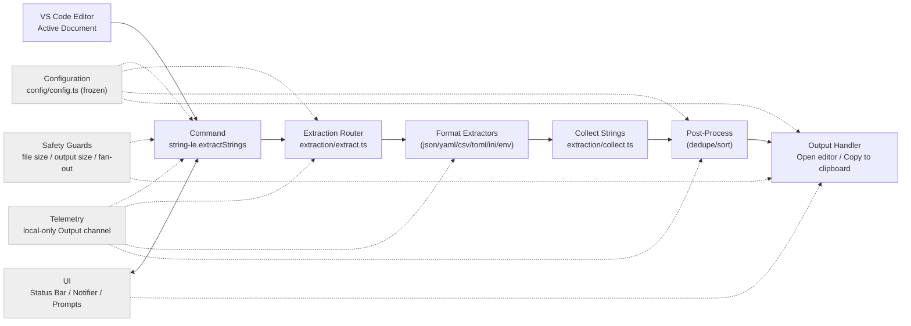
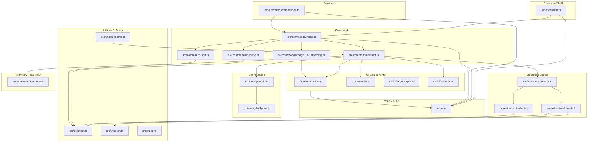
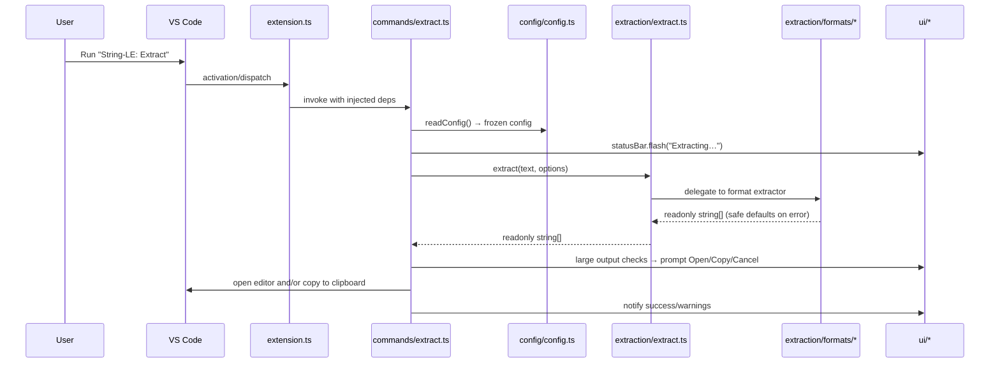
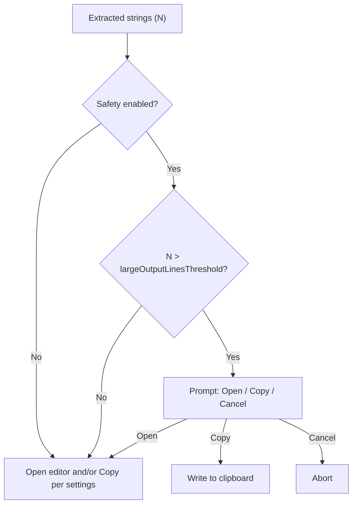
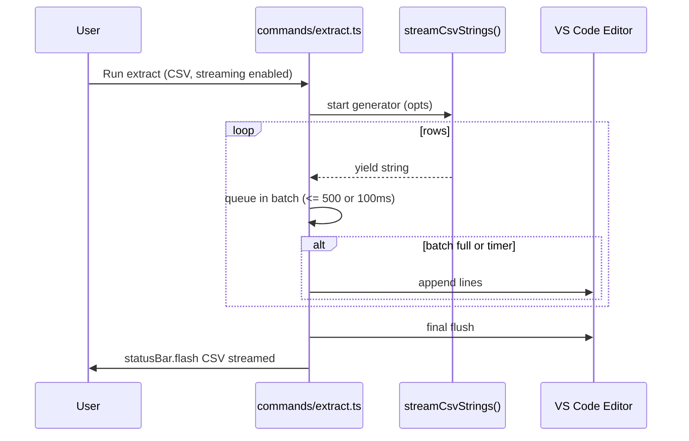

# String‑LE Architecture

High-level visuals of runtime flow and module boundaries. Complements `SPECIFICATION.md`.

### Core Structure

```
src/
├── extension.ts          # Minimal activation - registers commands/providers only
├── types.ts             # Core type definitions and interfaces
├── commands/            # Command implementations with dependency injection
│   ├── index.ts         # Centralized command registration
│   ├── extract.ts       # Main extraction command
│   ├── dedupe.ts        # Deduplication post-processing
│   ├── sort.ts          # Sorting post-processing
│   └── toggleCsvStreaming.ts  # CSV streaming toggle
├── extraction/          # String extraction engine
│   ├── extract.ts       # Router pattern - delegates to format handlers
│   ├── collect.ts       # Recursive object traversal utilities
│   ├── formats/         # Format-specific extractors
│   │   ├── json.ts      # JSON parser with error handling
│   │   ├── yaml.ts      # YAML parser
│   │   ├── csv.ts       # CSV parser with column selection
│   │   ├── toml.ts      # TOML parser
│   │   ├── ini.ts       # INI file parser
│   │   ├── dotenv.ts    # Environment file parser
│   │   └── fallback.ts  # Simple quoted string extraction
│   └── __data__/        # Test fixtures with expected outputs
├── config/              # Configuration management
│   ├── config.ts        # Main config reader with frozen objects
│   ├── settings.ts      # VS Code settings command registration
│   └── fileTypes.ts     # File type detection utilities
├── ui/                  # User interface components
│   ├── statusBar.ts     # Status bar factory with flash messaging
│   ├── notifier.ts      # Notification abstraction
│   ├── webView.ts       # Help webview implementation
│   ├── prompts.ts       # User input prompts
│   └── largeOutput.ts   # Large output handling dialogs
├── providers/           # VS Code providers
│   └── codeActions.ts   # Quick fix provider for supported file types
├── utils/               # Pure utility functions
│   ├── text.ts          # String manipulation (dedupe, sort)
│   ├── csv.ts           # CSV parsing utilities
│   └── filename.ts      # File extension detection
└── telemetry/           # Local-only logging
    └── telemetry.ts     # Output channel factory
```

## Runtime flow



Key properties:
- Configuration is read once per action and exposed as immutable objects
- Errors never throw from extractors; safe defaults are returned
- Safety prompts offer Open / Copy / Cancel for large outputs

## Module boundaries and dependencies



Conventions:
- All factory outputs are immutable; data structures use `readonly` and `Object.freeze()`
- Dependency injection is used for commands; `src/extension.ts` stays thin
- Modules prefer pure functions with explicit return types

---

## Architectural principles

- Minimal activation: `src/extension.ts` wires dependencies and registers disposables only
- Pure core: extraction, utilities, and post‑processing are pure functions with explicit return types
- Immutable data: config and results are frozen; no in‑place mutations
- Safety first: guard rails for file size, output size, and editor fan‑out
- Progressive disclosure: subtle status bar feedback; prompts only when needed
- Internationalization by default: manifest + runtime localization

## Component responsibilities (contracts)

- `commands/*`: Orchestrate user interactions, read config, call core functions, and present results
- `extraction/*`: Parse input and return `readonly string[]` with safe defaults
- `ui/*`: Present status, notifications, prompts, and large‑output dialogs
- `config/config.ts`: Read, validate, freeze, and expose settings
- `providers/*`: Offer editor integrations (e.g., code actions)
- `utils/*`: Side‑effect free helpers (text, csv, filename)
- `telemetry/telemetry.ts`: Local‑only Output channel logging

### Public interfaces (selected)

```ts
export type ExtractorOptions = Readonly<{
  onParseError?: (message: string) => void
  csvHasHeader?: boolean
}>

export type Extractor = (text: string, options?: ExtractorOptions) => readonly string[]

export type StringLeConfig = Readonly<{
  dedupeEnabled: boolean
  sortEnabled: boolean
  sortMode: 'off' | 'alpha-asc' | 'alpha-desc' | 'length-asc' | 'length-desc'
  copyToClipboardEnabled: boolean
  openResultsSideBySide: boolean
  postProcessOpenInNewFile: boolean
  safety: Readonly<{
    enabled: boolean
    fileSizeWarnBytes: number
    largeOutputLinesThreshold: number
    manyDocumentsThreshold: number
  }>
  csv: Readonly<{ streamingEnabled: boolean }>
  notificationsLevel: 'all' | 'important' | 'silent'
  showParseErrors: boolean
  telemetryEnabled: boolean
}>
```

## Sequence: Extract command



## Dependency injection contracts

```ts
export function registerAllCommands(
  context: vscode.ExtensionContext,
  deps: Readonly<{
    telemetry: Telemetry
    notifier: Notifier
    statusBar: StatusBar
  }>
): void
```

Guidelines:
- Construct UI and telemetry factories at activation; pass to command registrars
- Keep all state within function scope or minimal module closures; avoid globals

## Cross‑cutting concerns

- Localization: manifest strings in `package.nls*.json`; runtime via `vscode-nls` with `MessageFormat.file`
- Telemetry: local‑only; off by default; outputs to Output panel
- Safety: thresholds and prompts central to UX; never block without an option to proceed
- Cancellation: use `withProgress` and cancellation tokens for long operations

## Extensibility playbooks

- Add extractor: implement `Extractor`, register in router, add tests and fixtures, update fileTypes if needed
- Add command: create factory in `commands/`, declare in `package.json`, localize title, wire registration
- Add setting: update `package.json` contributes, localize, read/validate in config, consume in logic

## Performance budgets

- Small files (<50KB) end‑to‑end under ~50ms common path
- Avoid opening editors with results >50k lines; offer Copy instead
- Prefer streaming for CSV > ~5MB; avoid buffering entire file when unnecessary

## Security & privacy

- No network calls; all processing is local
- Respect workspace trust and virtual workspace limitations
- Validate user inputs and file operations; sanitize prompts

## Safety & UX decision flow



## CSV streaming pipeline (high level)



---
**Project:** [Issues](https://github.com/nolindnaidoo/string-le/issues) • [Pull Requests](https://github.com/nolindnaidoo/string-le/pulls) • [Releases](https://github.com/nolindnaidoo/string-le/releases) • [MIT License](LICENSE)

**Dev:** [Spec](SPECIFICATION.md) • [Architecture](ARCHITECTURE.md) • [Development](DEVELOPMENT.md)  • [Troubleshooting](TROUBLESHOOTING.md)

**Docs:** [Commands](COMMANDS.md) • [Notifications](NOTIFICATIONS.md) • [Status Bar](STATUSBAR.md) • [Config](CONFIGURATION.md) • [Performance](PERFORMANCE.md) • [I18N](I18N.md) • [Privacy](PRIVACY.md)
