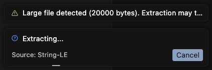

# String‑LE Screenshot Guide (Scaffold)

### Command Palette
- What this shows: the main command entry points and quick access in VS Code's Command Palette.

### Settings Panel
- What this shows: all `string-le.*` configuration options in the Settings UI.

### CSV Streaming (Editor)
- What this shows: incremental CSV extraction appending to the editor with batching.
<!-- Use HTML for animated GIF to ensure proper rendering and alt text -->

  

### Extraction Results (Side-by-Side)
- What this shows: extraction results opened beside the source document.

### Sort Mode Picker
- What this shows: picker showing alphabetical and length-based sort options.

### Status Bar
- What this shows: the Status Bar entry with tooltip and CSV streaming indicator.

### Notifications
- What this shows: info, warning, and error notifications used by the extension.

### Large Output Prompt
- What this shows: safety prompt for very large outputs with Open / Copy / Cancel.

### Coverage Report
- What this shows: HTML and text coverage reports for tests.

---
**Project:** [Issues](https://github.com/nolindnaidoo/string-le/issues) • [Pull Requests](https://github.com/nolindnaidoo/string-le/pulls) • [Releases](https://github.com/nolindnaidoo/string-le/releases) • [MIT License](LICENSE)

**Dev:** [Spec](SPECIFICATION.md) • [Architecture](ARCHITECTURE.md) • [Development](DEVELOPMENT.md)  • [Troubleshooting](TROUBLESHOOTING.md)

**Docs:** [Commands](COMMANDS.md) • [Notifications](NOTIFICATIONS.md) • [Status Bar](STATUSBAR.md) • [Config](CONFIGURATION.md) • [Performance](PERFORMANCE.md) • [I18N](I18N.md) • [Privacy](PRIVACY.md)
